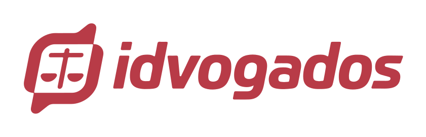

# idvogados API

⚠️ Esse projeto é um fork do projeto original [idvogados/idvogados-api](https://github.com/idvogados/idvogados-api)

## O que é o projeto?

O **idvogados** é um projeto de acesso à justiça que conecta trabalhadores às instituições voluntárias dispostas a lutar por melhores condições de trabalho.

## Como esse projeto funcionará?

Segundo o IBGE, mais de 13 milhões de brasileiros trabalham para aplicativos de serviços de entrega e transporte. Trabalhadores que fazem parte de um novo contexto trabalhista, muitas vezes sem qualquer garantia ou segurança, e se encontram fragilizados e privados de informações frente à grandes empresas.

O Idvogados usa a tecnologia a favor da informação e da proteção ao trabalhador, através de campanhas e serviços que conectam instituições de ensino, coletivos, advogados e grupos voluntários às causas da nova realidade trabalhista, ainda abordada de forma distante pelo nosso judiciário.

Pretendemos oferecer espaços para tirar dúvidas, analisar casos, apoiar campanhas e para o oferecimento de apoio jurídico em casos de abuso à dignidade e integridade do trabalhador.

## Como surgiu a idéia?

Unidos pela ideia apresentada no episódio Delivery, do Programa Greg News, exibido no dia 17 de abril de 2020, voluntários das mais diversas áreas se reuniram para tornar realidade o sonho de facilitar o contato dos trabalhadores com instituições que possam ajudá-lo judicialmente, através de ferramentas tecnológicas.

Durante o Desenvolvimento do projeto, muitos pontos tiveram que ser acertados, e o hoje o Idvogados tem pretensões mais abrangentes, que visam atender grupos fragilizados e pessoas que, pelos mais diversos motivos, tem seu acesso à justiça dificultado.

## Licença

Este projeto é desenvolvido sob a licença EUPL-1.2. Veja o arquivo [LICENSE.txt](./LICENSE.txt) para saber mais detalhes.
